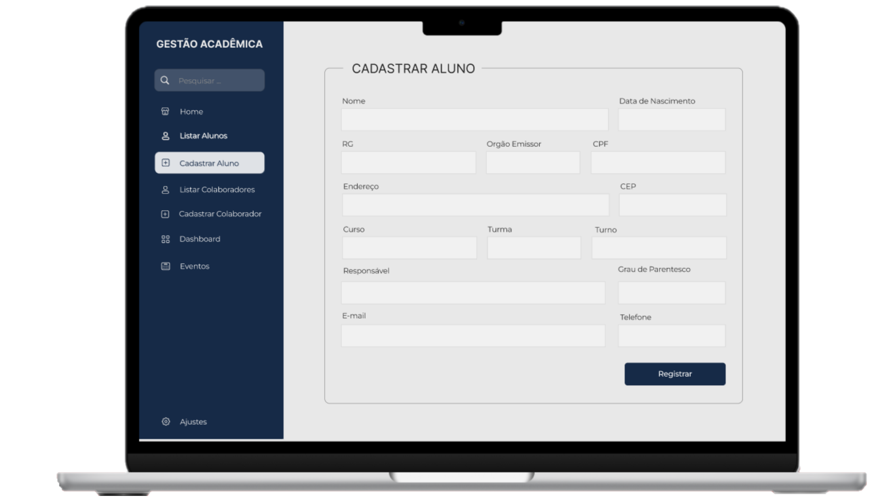

# Gestão Acadêmica

Sistema web em PHP e MySQL para cadastrar, listar, editar e excluir alunos de uma escola.

> **EN:** PHP and MySQL web app to create, list, edit and delete school students (CRUD).

## Funcionalidades

- Cadastro de aluno (nome, data de nascimento, CPF)
- Listagem de alunos em tabela
- Edição dos dados do aluno
- Exclusão com confirmação

## Tecnologias

PHP · MySQL (MySQLi) · HTML · Bootstrap 5

## Próximos passos

- Usar prepared statements nas consultas SQL
- Adicionar o cadastro de colaboradores e a busca por nome

## Autora

**Delis Guerra**, Engenheira de Software Full Stack · Recife-PE
[LinkedIn](https://www.linkedin.com/in/delisguerra) · [GitHub](https://github.com/Delisg)
